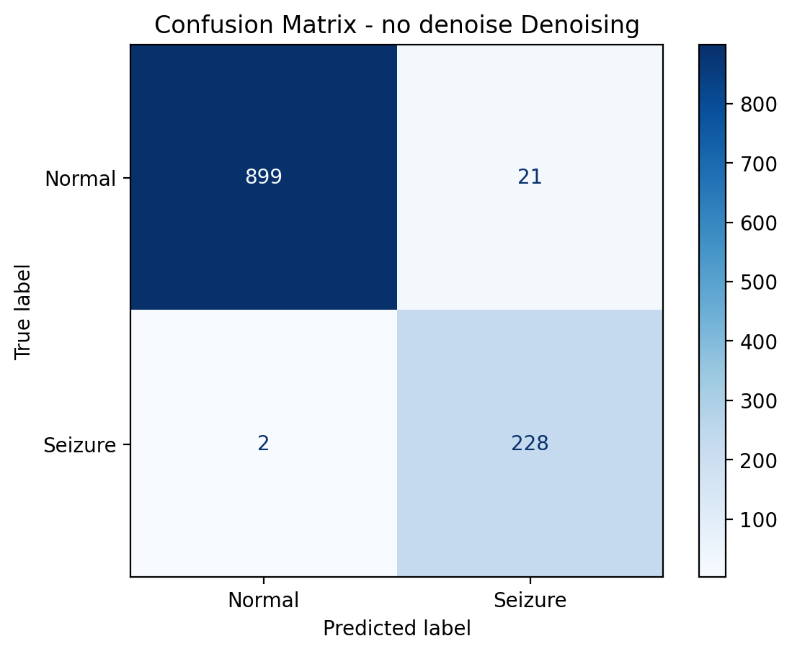
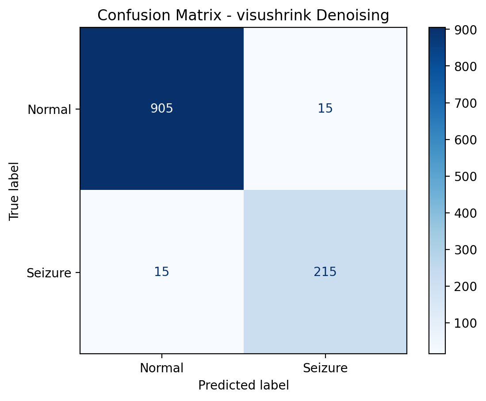

Model architecture: 
conv2D 1
Batch norm 1
Relu 1
Maxpool 1
conv 2D 2
Batch norm 2
Relu 2
Maxpool 2
Dropout 1
FCL 1
Relu 3
Dropout 2
Relu 4
2 unit softmax

Test run 1: resulting scalograms in results_12_09_25. 

Results: 

No Denoise:
f1 accuracy: 0.9800
Scalogram:

SQWTOLOG: 
f1 accuracy: 0.9739
Scalogram:

RIGRSURE: 
f1 accuracy: 0.9791
Scalogram:

HEURSURE: 
f1 accuracy: 0.9661
Scalogram:

VISURHINK: 
f1 accuracy: 0.9739
Scalogram: 

