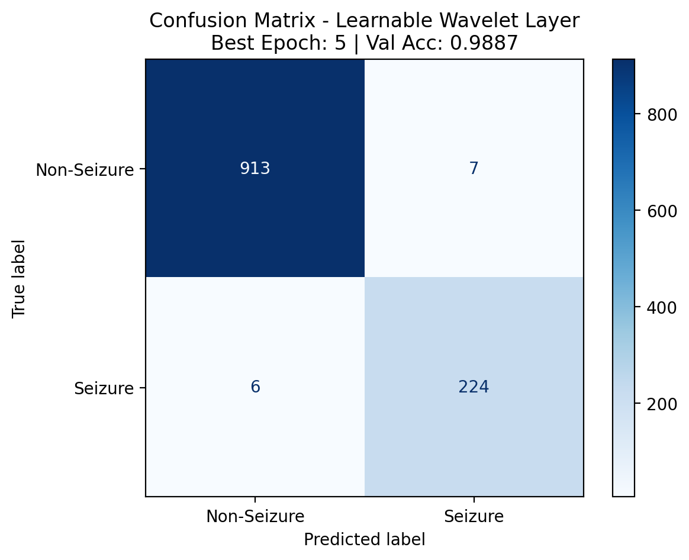
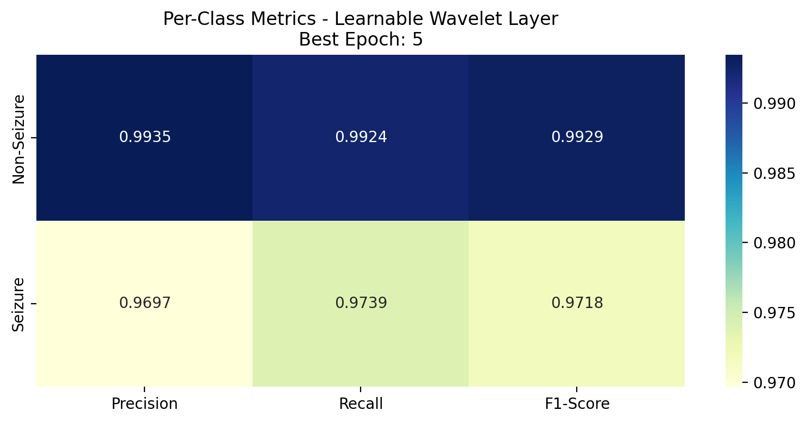
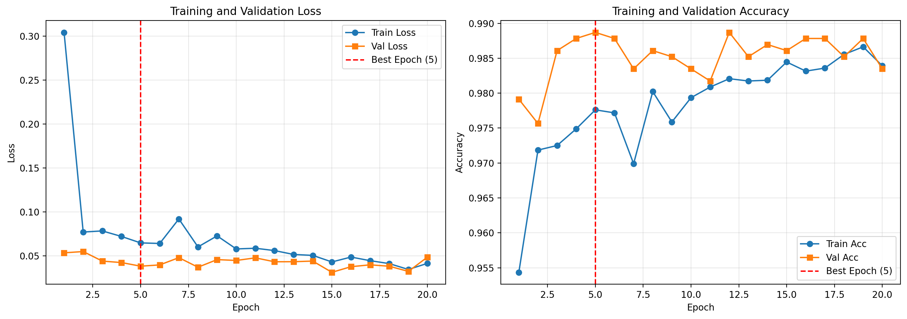

This is our second model implementation. The main changes are:

CWT_Transform: RIGR_sure is now based off of MAD estimate instead of presuming sigma = 1, this is also impacts heuresure

dataloader.py: There is temporal leakage between the train set and validation set, this is because the same patients seizure is recorded into 23 different samples, leading to an artifically high accuracy rate. We switch from doing a 1:4 split of samples to a 1:4 split of subjects to mitigate temporal leakage.

Model.py: The architecture now includes a learnable wavelet decomposition layer. Specifically we are training the scales and the central frequency, bandwith of the complex morlet wavelet as defined in pywavelets.

The accuracy of training 20 Epochs is compiled and the results are down here:

Confusion Matrix

F1 Metric

Training History

Ultimately our model learned the parameters:
Learned Wavelet Parameters:

Centre Frequency: 6.223094

Bandwidth Frequency: 1.025627

Denoising Threshold: 0.100738

Scale Range:

Min Scale: 1.047443

Max Scale: 65.945869

If you would like the specific model weights please email 271296@hkis.edu.hk in order to recieve the .pt file.
